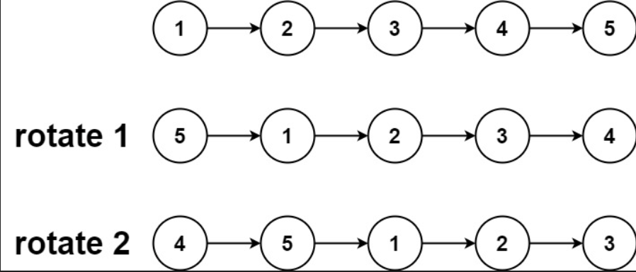

# Day 4: Rotate Linked List

## Problem Description

Given the a linked list, rotate the list to the right by k places.

## Complexity Analysis

Running time O(n - k) we travel the list the node a position n - k - 1 because it would be our tail, depends in the list length and user input as k

## Programming Language Used

C#

## Example

Example 1:

List = [1,2,3,4,5]
Input: k = 2
Output: [4,5,1,2,3]

Example 2:

List = [0,1,2]
Input: k = 4
Output: [2,0,1]

## Author

Juan Camilo Marmolejo
jmarmol1013
